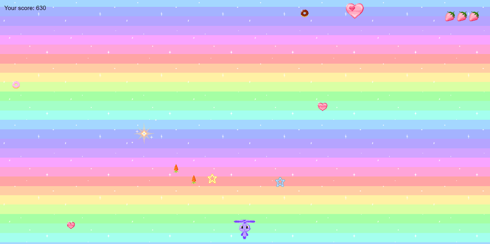

## Bunny on Cloud: Mission Love in Space
This is an extremely simple and enjoyable 2D game that focuses on a single level full of charm and joy. Players take on the role of a cute bunny traveling through space, shooting colorful carrots into hearts to heal them and restore love :heart:

### Note:

The initial code and some elements of the project are based on this tutorial: [Tutorial](https://www.youtube.com/playlist?list=PLDyH9Tk5ZdFzEu_izyqgPFtHJJXkc79no). All rules and copyrights regarding these excerpts belong to their author. I would like to extend my sincere thanks to Ansimuz for providing this tutorial and enabling learning.

### Running the Project using Live Server

To run this project using Live Server, follow the steps below:

1. Install the Live Server extension for your browser (available for many browsers, e.g., in Visual Studio Code).
2. Open the project in your development environment.
3. Locate the `index.html` file.
4. Right-click on the `index.html` file.
5. Choose the "Open with Live Server" option from the context menu.

The project should launch in your browser, and any changes made to the code will be immediately reflected.

Thank you for the inspiration and learning opportunity!

---

## Królik na Chmurze: Misja Miłości w Kosmosie
To niezwykle prosta i przyjemna gra 2D, która skupia się na jednym poziomie pełnym uroku i radości. Gracze wcielają się w uroczego królika, który podróżuje po kosmosie, strzelając kolorowymi marchewkami w serca, aby je uzdrowić i przywrócić miłość :heart:

### Uwaga:

Kod początkowy oraz niektóre elementy projektu są oparte na tym samouczku: https://www.youtube.com/playlist?list=PLDyH9Tk5ZdFzEu_izyqgPFtHJJXkc79no. Wszelkie zasady i prawa autorskie dotyczące tych fragmentów należą do ich autora. Serdecznie dziękuję Ansimuz za udostępnienie tego samouczka i umożliwienie nauki.

### Uruchamianie projektu za pomocą Live Server

Aby uruchomić ten projekt za pomocą Live Server, postępuj zgodnie z poniższymi krokami:

1. Zainstaluj rozszerzenie Live Server dla swojej przeglądarki (dostępne dla wielu przeglądarek, np. w przypadku Visual Studio Code).
2. Otwórz projekt w swoim środowisku programistycznym.
3. Zlokalizuj plik `index.html`.
4. Kliknij prawym przyciskiem myszy na pliku `index.html`.
5. Wybierz opcję "Open with Live Server" z menu kontekstowego.

Projekt powinien zostać uruchomiony w twojej przeglądarce, a wszelkie zmiany w kodzie będą natychmiast odzwierciedlone

Dziękuję za inspirację i możliwość nauki!

